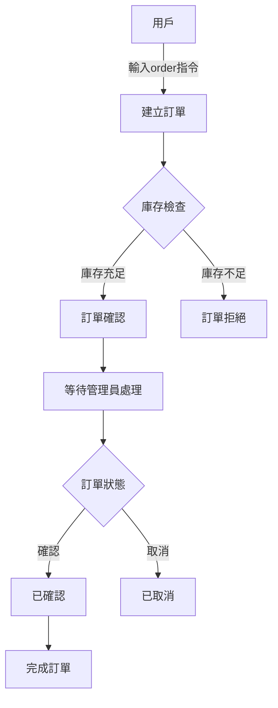
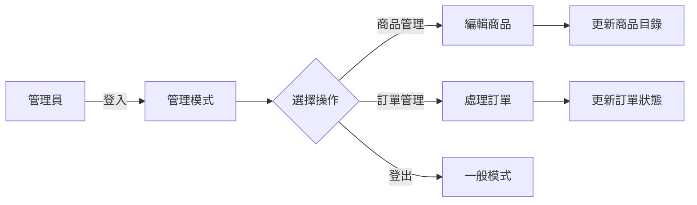

# LINE Bot 商品販售小幫手 🤖

這是一個基於 LINE Messaging API 開發的商品販售助手機器人，提供商品展示、訂單管理等功能。讓您輕鬆建立自己的 LINE 商店！

## 🌟 主要功能

### 👥 使用者管理
- 一般用戶模式（預設）
- 管理員模式（需要密碼登入）
- 使用者狀態追蹤
- 登入嘗試次數限制
- Session 管理

### 🛍️ 商品管理
- 查看商品目錄
- 新增/編輯/刪除商品（管理員功能）
- 庫存管理與警告
- 商品狀態追蹤

### 📦 訂單管理
- 建立新訂單
- 查看訂單狀態
- 更新訂單狀態（管理員功能）
- 訂單歷史記錄

### 💾 資料儲存
- 使用 JSON 檔案儲存資料
- 可輕易擴充為資料庫儲存
- 資料存取錯誤處理

### 🔒 安全性
- 管理員密碼加密儲存
- 登入嘗試次數限制
- 暫時封鎖機制
- 權限控制
- Session 管理

## 🚀 快速開始

### 系統需求
- Python 3.8+
- LINE Official Account（免費版即可）
- ngrok（用於本地開發）或可公開訪問的伺服器

### 完整安裝步驟

1. **複製專案**
```bash
git clone https://github.com/Huiyue420/line-store-bot.git
cd line-store-bot
```

2. **建立虛擬環境**
```bash
# Windows
python -m venv venv
.\venv\Scripts\activate

# Linux/Mac
python -m venv venv
source venv/bin/activate
```

3. **安裝依賴套件**
```bash
pip install -r requirements.txt
```

4. **環境設定**
   - 複製 `.env.example` 為 `.env`
   - 填入以下內容：
```plaintext
# LINE Bot 設定
LINE_CHANNEL_ACCESS_TOKEN=你的Channel存取權杖
LINE_CHANNEL_SECRET=你的Channel密鑰

# 管理員設定
ADMIN_PASSWORD=你的管理員密碼

# ngrok 設定（開發環境用）
NGROK_AUTH_TOKEN=你的ngrok_authtoken

# 應用程式設定
DEBUG=True
STOCK_WARNING_THRESHOLD=5  # 商品庫存警告閾值
SESSION_EXPIRE_HOURS=24    # Session 有效期（小時）
```

### LINE Official Account 設定指南

1. **建立 LINE Official Account**
   - 前往 [LINE Developers Console](https://developers.line.biz/console/)
   - 建立 Provider（如果沒有）
   - 建立 Channel（Messaging API）
   - 取得 Channel Secret 和 Channel Access Token

2. **Webhook 設定**
   - 開發環境：使用 ngrok 提供的網址
   - 生產環境：使用您的伺服器網址
   - Webhook URL 格式：`https://您的網域/callback`
   - 確保開啟 Webhook 功能
   - 關閉自動回覆訊息
   - 關閉歡迎訊息

## 💻 開發指南

### 本地開發（使用 ngrok）
```bash
# 啟動開發伺服器（自動設定 ngrok）
python run_with_ngrok.py
```

### 生產環境部署
```bash
# 使用 gunicorn 啟動（建議使用 systemd 或 supervisor 管理）
gunicorn -w 4 -b 0.0.0.0:5000 wsgi:app
```

### 程式碼品質管理
```bash
# 執行所有測試
pytest

# 格式化程式碼
black .

# 檢查程式碼品質
flake8
```

## 📝 使用說明

### 一般用戶指令
| 指令 | 說明 | 範例 |
|------|------|------|
| `menu` | 查看商品目錄 | `menu` |
| `order` | 下訂單 | `order 商品A 2 商品B 1` |
| `myorders` | 查看我的訂單 | `myorders` |
| `help` | 取得說明 | `help` |

### 管理員指令
| 指令 | 說明 | 範例 |
|------|------|------|
| `!admin` | 登入管理員模式 | `!admin 密碼` |
| `edit menu add` | 新增商品 | `edit menu add 商品A 100 50 商品描述` |
| `edit menu edit` | 編輯商品 | `edit menu edit 商品A 120 45 新描述` |
| `edit menu delete` | 刪除商品 | `edit menu delete 商品A` |
| `view orders` | 查看訂單 | `view orders pending` |
| `update order` | 更新訂單狀態 | `update order ORDER001 confirmed` |
| `logout` | 登出管理員模式 | `logout` |

## 📁 專案結構
```
line_store_app/
├── app.py              # 主程式
├── wsgi.py            # 生產環境入口
├── run_with_ngrok.py  # 開發環境入口
├── requirements.txt    # 相依套件
├── README.md          # 說明文件
├── .env               # 環境變數
├── .env.example       # 環境變數範例
├── data/              # 資料儲存
│   ├── menu.json      # 商品目錄
│   ├── orders.json    # 訂單資料
│   └── user_state.json # 使用者狀態
├── tests/             # 測試目錄
│   └── test_app.py    # 測試程式
└── utils/             # 功能模組
    ├── auth.py        # 身份驗證
    ├── menu.py        # 商品管理
    ├── order.py       # 訂單管理
    ├── user_state.py  # 使用者狀態
    └── command_handler.py # 命令處理
```

## 🔄 系統流程圖

### 訂單處理流程


### 管理員操作流程


## ⚠️ 注意事項

1. **首次使用設定**
   - 確保已正確設定 LINE Channel Secret 和 Access Token
   - 確保已設定管理員密碼
   - 確保已建立所需的資料目錄

2. **安全性考量**
   - 管理員密碼使用 SHA-256 加密儲存
   - 登入失敗 3 次後會暫時封鎖帳號（15 分鐘）
   - Session 有效期為 24 小時
   - 定期更換管理員密碼

3. **運作注意事項**
   - 商品庫存低於 5 件時會發出警告
   - 訂單狀態變更會自動處理庫存
   - 每次重啟 ngrok 都需要更新 Webhook URL

## 🔜 開發規劃

### 近期規劃
- [ ] 資料庫整合（PostgreSQL）
- [ ] 金流系統整合
- [ ] 多語言支援
- [ ] 自動通知功能
- [ ] Docker 支援

### 未來展望
- [ ] 報表統計功能
- [ ] 會員等級系統
- [ ] API 文件生成
- [ ] 自動化測試改進
- [ ] 效能監控

## 🤝 貢獻指南

1. Fork 此專案
2. 建立功能分支：`git checkout -b feature/AmazingFeature`
3. 提交更改：`git commit -m 'Add some AmazingFeature'`
4. 推送分支：`git push origin feature/AmazingFeature`
5. 提交 Pull Request

## 📄 授權條款

此專案使用 MIT 授權條款 - 詳見 [LICENSE](LICENSE) 檔案

## 🙋‍♂️ 支援與問題回報

如果您在使用過程中遇到任何問題，或有任何建議，歡迎：
1. 在 GitHub Issues 中提出
2. 提交 Pull Request
3. 聯繫專案維護者

---
⭐ 如果這個專案對您有幫助，歡迎給我們一顆星星！ 