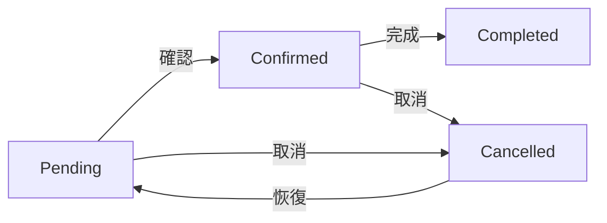

# LINE Bot 商品販售小幫手

這是一個基於 LINE Messaging API 開發的商品販售助手機器人，提供商品展示、訂單管理等功能。

## 🌟 主要功能

### 👥 使用者管理
- 一般用戶模式（預設）
- 管理員模式（需要密碼登入）
- 使用者狀態追蹤
- 登入嘗試次數限制
- Session 管理

### 🛍️ 商品管理
- 查看商品目錄
- 新增/編輯/刪除商品（管理員功能）
- 庫存管理與警告
- 商品狀態追蹤

### 📦 訂單管理
- 建立新訂單
- 查看訂單狀態
- 更新訂單狀態（管理員功能）
- 訂單歷史記錄

### 💾 資料儲存
- 使用 JSON 檔案儲存資料
- 可輕易擴充為資料庫儲存
- 資料存取錯誤處理

### 🔒 安全性
- 管理員密碼加密儲存
- 登入嘗試次數限制
- 暫時封鎖機制
- 權限控制
- Session 管理

## 🚀 開始使用

### 系統需求
- Python 3.8+
- LINE Official Account（免費版即可）
- ngrok（用於本地開發）或可公開訪問的伺服器

### 安裝步驟

1. 建立虛擬環境：
```bash
python -m venv venv

# Windows
.\venv\Scripts\activate
# Linux/Mac
source venv/bin/activate
```

2. 安裝依賴套件：
```bash
pip install -r requirements.txt
```

3. 設定環境變數：
   - 複製 `.env.example` 為 `.env`
   - 填入以下內容：
```
# LINE Bot 設定
LINE_CHANNEL_ACCESS_TOKEN=你的Channel存取權杖
LINE_CHANNEL_SECRET=你的Channel密鑰

# 管理員設定
ADMIN_PASSWORD=960130

# ngrok 設定（開發環境用）
NGROK_AUTH_TOKEN=你的ngrok_authtoken

# 應用程式設定
DEBUG=True
STOCK_WARNING_THRESHOLD=5  # 商品庫存警告閾值
SESSION_EXPIRE_HOURS=24    # Session 有效期（小時）
```

### LINE Official Account 設定

1. 建立 LINE Official Account：
   - 前往 [LINE Developers Console](https://developers.line.biz/console/)
   - 建立 Provider（如果沒有）
   - 建立 Channel（Messaging API）
   - 取得 Channel Secret 和 Channel Access Token

2. Webhook 設定：
   - 開發環境：使用 ngrok 提供的網址
   - 生產環境：使用您的伺服器網址
   - Webhook URL 格式：`https://您的網域/callback`
   - 確保開啟 Webhook 功能
   - 關閉自動回覆訊息
   - 關閉歡迎訊息

## 💻 開發指南

### 本地開發（使用 ngrok）
```bash
# 啟動開發伺服器（自動設定 ngrok）
python run_with_ngrok.py
```

### 生產環境部署
```bash
# 使用 gunicorn 啟動（建議使用 systemd 或 supervisor 管理）
gunicorn -w 4 -b 0.0.0.0:5000 wsgi:app
```

### 執行測試
```bash
# 執行所有測試
pytest

# 執行特定測試
pytest tests/test_app.py -v
```

### 程式碼品質管理
```bash
# 格式化程式碼
black .

# 檢查程式碼品質
flake8
```

## 📝 使用說明

### 一般用戶指令
- `menu`：查看商品目錄
- `order 商品名稱 數量 [商品名稱 數量 ...]`：下訂單
- `myorders`：查看我的訂單
- `help`：取得說明

### 管理員指令
- `!admin 密碼`：登入管理員模式
- `edit menu add 商品名稱 價格 庫存 [描述]`：新增商品
- `edit menu edit 商品名稱 [價格 庫存 描述]`：編輯商品
- `edit menu delete 商品名稱`：刪除商品
- `view orders [status]`：查看訂單
- `update order 訂單編號 狀態`：更新訂單狀態
- `logout`：登出管理員模式

## 📁 專案結構
```
line_store_app/
├── app.py              # 主程式
├── wsgi.py            # 生產環境入口
├── run_with_ngrok.py  # 開發環境入口
├── requirements.txt    # 相依套件
├── README.md          # 說明文件
├── .env               # 環境變數
├── .env.example       # 環境變數範例
├── data/              # 資料儲存
│   ├── menu.json      # 商品目錄
│   ├── orders.json    # 訂單資料
│   └── user_state.json # 使用者狀態
├── tests/             # 測試目錄
│   └── test_app.py    # 測試程式
└── utils/             # 功能模組
    ├── auth.py        # 身份驗證
    ├── menu.py        # 商品管理
    ├── order.py       # 訂單管理
    ├── user_state.py  # 使用者狀態
    └── command_handler.py # 命令處理
```

## 🔄 訂單狀態流程



## ⚠️ 注意事項

1. 首次使用時會自動建立必要的資料目錄和檔案
2. 管理員密碼使用 SHA-256 加密儲存
3. 登入失敗 3 次後會暫時封鎖帳號（15 分鐘）
4. Session 有效期為 24 小時
5. 商品庫存低於 5 件時會發出警告
6. 訂單狀態變更會自動處理庫存
7. 開發時請確保：
   - 已正確設定 Webhook URL
   - 已啟用 Webhook
   - 已關閉自動回覆訊息
   - 已關閉歡迎訊息

## 🔜 開發規劃

1. 資料庫整合
   - [ ] 支援 SQLite
   - [ ] 支援 PostgreSQL
   - [ ] 資料遷移工具

2. 功能強化
   - [ ] 多語言支援
   - [ ] 整合金流
   - [ ] 自動通知
   - [ ] 報表統計
   - [ ] 批次處理

3. 安全性強化
   - [ ] API 限流
   - [ ] 資料加密
   - [ ] 備份機制

4. 開發工具
   - [ ] Docker 支援
   - [ ] CI/CD 整合
   - [ ] 自動化測試
   - [ ] 效能監控

## 📄 授權

MIT License 